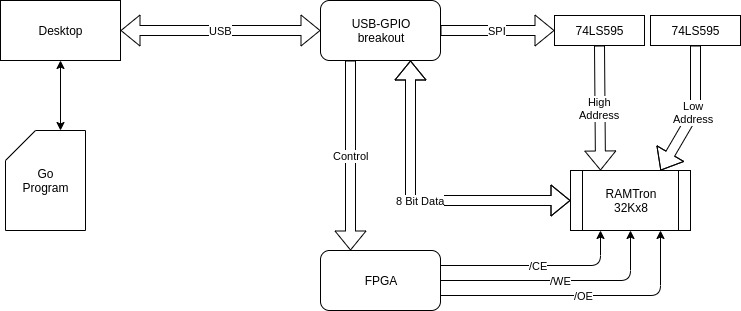
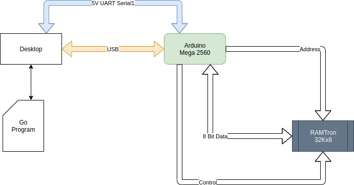

# Programmmer
The source code here is supports the MC6809 SBC project.

## RamTron NVRam programmer
There are two programmer frameworks:
* An FPGA assisted programmer. The FPGA generates the tight timing specs for the control signals while the Go code manages the address and data via a USB-to-GPIO breakout.
* An Arduino based programmer. The Arduino handles the connectivity to the NV chip as proxy to Go code via a second UART connection on the Mega.

### FPGA assisted programmer
An early experimental version of the programmer is located under the two following folders:
* **src/NVRamProgrammer**: contains the [Go](https://golang.org/) frontend and controller program. It controls both the older [TinyFPGA-B2](https://tinyfpga.com/) and [Adafruit USB-to-GPIO](https://www.adafruit.com/product/2264). First it sends the Address and Data to GPIO then it sends signals to the FPGA to complete the memory cycle.
* **src/TinyFPGAB2**: contains the Verilog code for generating NVRam control signals.

It was simply meant to test if I could program the NV Ram. The Non-Volital Ram is an old technology originally designed by RamTron which has since be bought by Cypress Semi.

Breadboard layout:


Ignore the *TTGO T-Display* microcontroller in the upper left, it was used for something else. Also, some of the Logic analyser probes are still hooked up in the upper right.

The *grey* wires are the data, the *green* are the address, the *yellow* are the signals to the FPGA and the *white/red/yellow* are the control for the NVRam.

You only need to connect a powered USB cable to the FPGA once it is programmed. The GPIO needs to be connected to a computer so the Go program can control it.

Logic Diagram:



### Arduino based programmer
This programmer variant is faster, however, the current arduino code doesn't generate control signals within the 2us memory cycle window--the signals are around 4.1us. Nonetheless it does work with the caveat that endurance drops. The eventual goal would be to either figure out how to manipulate the Arduino' control registers for more precise timing or introduce an FPGA as done in the other programmer.

The source is located under the two folders:
* MegaGoNVProgrammer (Go client)
* MegaNVRamProgrammer (Arduino proxy)

This is an image of the layout:

.

The Ziff socket *up-top* is the final version that will plug *on top* of the Mega.

Logic Diagram:



#### Pin connections
UART:
```
TX to Mega Pin 19
RX to Mega Pin 18
Grnd to Mega Grnd
```
RAMTron:
```
Pin 20 needs to be biased to VDD with a 2.2K resistor.
```
Mega to NVRam:
```
A0  : Pin 53 -> Pin 10
A1  : Pin 51 -> Pin 9
A2  : Pin 49 -> Pin 8
A3  : Pin 47 -> Pin 7
A4  : Pin 45 -> Pin 6
A5  : Pin 43 -> Pin 5
A6  : Pin 41 -> Pin 4
A7  : Pin 39 -> Pin 3
A8  : Pin 37 -> Pin 25
A9  : Pin 35 -> Pin 24
A10 : Pin 33 -> Pin 21
A11 : Pin 31 -> Pin 23
A12 : Pin 29 -> Pin 2
A13 : Pin 27 -> Pin 26
A14 : Pin 25 -> Pin 1
D0  : Pin 52 -> Pin 11
D1  : Pin 50 -> Pin 12
D2  : Pin 48 -> Pin 13
D3  : Pin 46 -> Pin 15
D4  : Pin 44 -> Pin 16
D5  : Pin 42 -> Pin 17
D6  : Pin 40 -> Pin 18
D7  : Pin 38 -> Pin 19
WE  : Pin 22 -> Pin 27
OE  : Pin 24 -> Pin 22
CE  : Pin 26 -> Pin 20
```

#### Usage:
* First plugin in the USB cable into Mega. **Note: not doing so may cause your desktop USB drivers to become unstable or the UART device to become unstable.**
* Next plugin the UART-5V cables into pins *TX1*,*RX1* and *Ground*. Don't connect the 5V wire as the Mega will supply VDD.

When *powering down* the system **first** remove the UART cable and **THEN** the USB cable.